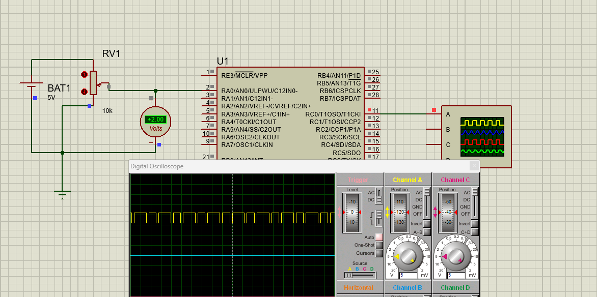

# PWM Generator – 225 Hz (PIC Microcontroller)

This project implements a software-based PWM signal at **225 Hz** using **Timer0**, **ADC**, and internal oscillator settings of a PIC microcontroller (XC8). The PWM duty cycle is controlled by an analog input read through the onboard ADC.

## Features

* PWM frequency fixed at **225 Hz** (period = 4.444 ms).
* Duty cycle varies according to the analog voltage on **RA0/AN0**.
* Automatic prescaler selection to achieve accurate high/low timing.
* Timer0 interrupt used to toggle the output pin.
* Fully dynamic calculation of high and low times based on ADC readings.

## How It Works

1. The ADC reads the input voltage on AN0.
2. The duty cycle high-time (`t_h`) is computed as a proportion of the PWM period.
3. The low-time (`t_l`) is obtained by subtracting `t_h` from the total period.
4. Depending on the required timing, an appropriate Timer0 prescaler is selected.
5. High and low reload values for Timer0 are calculated.
6. The PWM output is generated on **RC0** inside the Timer0 interrupt.

## Microcontroller Configuration

* **Internal oscillator** at 8 MHz.
* **Timer0** in timer mode with selectable prescaler.
* **ADC** right-justified, Vdd reference, AN0 enabled.
* **Interrupts** enabled for Timer0 overflow.

## File Included

* Main source file containing configuration bits, initialization routines, ADC reading logic, prescaler selection, Timer0 reload calculations, and PWM ISR.

## Hardware Requirements

* PIC microcontroller compatible with XC8.
* Analog input connected to **RA0/AN0**.
* PWM output available on **RC0**.

## Output

The program continuously generates a PWM waveform at **225 Hz**, with duty cycle proportional to the analog input voltage.

